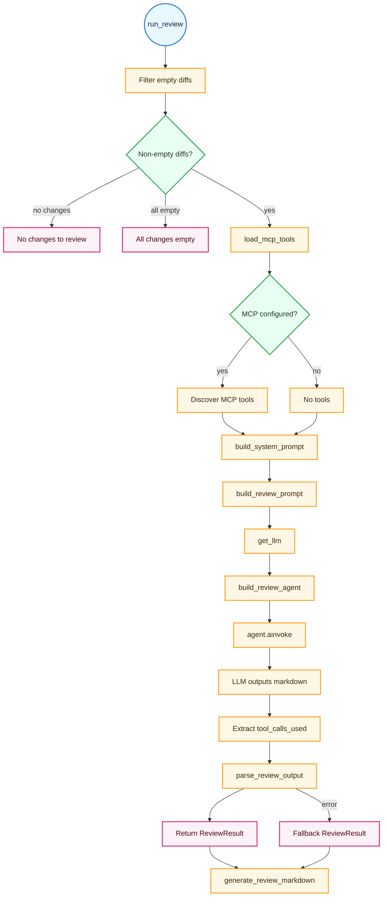

# Deek Hook - Review

AI-powered code review library for Python. Accepts GitLab-style diffs and returns structured review results.

Designed to be installed into any Python backend and called programmatically — no CLI, no git hooks, no database required.

## Install (uv)

This project is **uv-native** and uses `pyproject.toml` as the single source of truth.

From a consuming backend project:

```bash
uv add deek-hook-review[openai]      # OpenAI (default)
uv add deek-hook-review[anthropic]   # Anthropic
uv add deek-hook-review[ollama]      # Ollama (local)
uv add deek-hook-review[all]         # All providers
```

For local development (Ollama is the default LLM; no API keys needed):

```bash
uv sync
```

### Test with local Ollama (e.g. gpt-oss:20b)

1. Start Ollama and pull the model: `ollama run gpt-oss:20b` (or your model name from `ollama list`).
2. In this repo, run:

```bash
uv run python test_ollama.py
```

To use a different model, set `OLLAMA_MODEL` in `test_ollama.py` to the name shown by `ollama list`.

## Public API (import from here only)

**Always import from the top-level package** so your code works whether this repo is installed from a path, PyPI, or inside Docker:

```python
from deep_hook_review import run_review, GitLabChange, DeepConfig, config_from_yml, load_config
```

Do **not** use internal submodules (e.g. `deep_hook_review.core`) — they are not part of the stable API and may differ across installations.

## Quick Start

```python
import asyncio

from deep_hook_review import GitLabChange, config_from_yml, run_review

changes = [
    GitLabChange(
        old_path="app/models/user.py",
        new_path="app/models/user.py",
        diff="@@ -10,6 +10,8 @@\n class User:\n     name: str\n+    email: str\n+    password: str  # plain text\n",
    ),
    GitLabChange(
        old_path="VERSION",
        new_path="VERSION",
        diff="@@ -1 +1 @@\n-1.9.7\n+1.9.8",
        new_file=False,
        renamed_file=False,
        deleted_file=False,
    ),
]

config = config_from_yml("deep.yml")
result = asyncio.run(run_review(changes, config))

print(f"Total issues: {result.total_issues}")
print(f"Critical: {len(result.critical)}")

for issue in result.issues:
    print(f"[{issue.severity.value}] {issue.location}: {issue.message}")
```

## Input Format

Changes are passed as a list of `GitLabChange` objects, matching the GitLab MR changes API format:

```python
GitLabChange(
    old_path="VERSION",
    new_path="VERSION",
    a_mode="100644",
    b_mode="100644",
    diff="@@ -1 +1 @@\n-1.9.7\n+1.9.8",
    new_file=False,
    renamed_file=False,
    deleted_file=False,
)
```

This maps directly to the response from `GET /projects/:id/merge_requests/:mr_iid/changes`.

## Configuration

### Inline

```python
from deep_hook_review import DeepConfig, LLMConfig

config = DeepConfig(
    language="python",
    guidelines=["Use type hints everywhere", "No bare except clauses"],
    llm=LLMConfig(provider="openai", model="gpt-4o-mini", temperature=0.1),
)
```

### From deep.yml

```python
from deep_hook_review import load_config

config = load_config("deep.yml")
```

```yaml
# deep.yml
language: python

guidelines:
  - "Follow project coding standards"
  - "All public functions must have type hints"

file_guidelines:
  - pattern: "*.py"
    guidelines:
      - "Use docstrings on all public functions"
  - pattern: "tests/**"
    guidelines:
      - "Each test must have a clear assertion"

llm:
  provider: openai
  model: gpt-4o-mini
  temperature: 0.1

review:
  max_diff_lines: 3000
```

### File-level Guidelines

`file_guidelines` lets you attach rules to files matching a glob pattern. These are injected into the prompt only for matching files in the change set:

```yaml
file_guidelines:
  - pattern: "src/api/**"
    guidelines:
      - "All endpoints must validate input with Pydantic"
      - "Return proper HTTP status codes"
  - pattern: "*.sql"
    guidelines:
      - "Avoid SELECT *"
      - "All migrations must be reversible"
```

## MCP Integration

This project can optionally use external MCP servers to provide extra context/tools to the review agent.

If `config.mcp.servers` is configured, `run_review(...)` calls `load_mcp_tools(config)` which connects to each MCP server (via `langchain-mcp-adapters`) and discovers the tools the agent is allowed to call.

Those discovered tools are passed into the LangChain agent, so the model can invoke them during review when needed.

Important behavior:
- If MCP is not configured (or `mcp.servers` is empty), the review runs with no tools.
- If MCP tool discovery fails, the review aborts (the error propagates).

Example `deep.yml` snippet:

```yaml
mcp:
  servers:
    - name: guidelines
      url: http://localhost:8001
      description: "Fetch coding guidelines and architecture rules relevant to modified files."
      transport: streamable_http
      headers: {}
```

## Output

`run_review` returns a `ReviewResult`:

```python
result.tldr           # list[str] — 3-6 bullet summary
result.context        # str — paragraph on what's being solved
result.walkthrough    # list[FileChange] — per-file summary table
result.issues         # list[Issue] — all issues found
result.critical       # list[Issue] — severity == critical
result.warnings       # list[Issue] — severity == warning
result.suggestions    # list[Issue] — severity == suggestion
result.has_critical   # bool
result.total_issues   # int
result.flow           # str — Mermaid flowchart
result.raw_output     # str — raw LLM markdown
```

Each `Issue` has:

```python
issue.file       # str — file path
issue.line       # int | None — line number
issue.message    # str — description
issue.severity   # Severity — critical / warning / suggestion
issue.location   # str — "file:line" or just "file"
```

### Markdown Export

```python
from deep_hook_review import generate_review_markdown

markdown = generate_review_markdown(result)
```

## Architecture

```
deep_hook_review/
├── __init__.py          # Public API: run_review, load_config, models
├── agent/
│   ├── review_agent.py  # Main entry point: async run_review()
│   ├── graph.py         # LangChain agent builder (LLM/tool loop handled by LangChain)
│   ├── parser.py        # LLM markdown → ReviewResult
│   └── state.py         # TypedDict state shape (currently not used by run_review())
├── config/
│   └── loader.py        # YAML / dict config loading + validation
├── core/
│   ├── models.py        # All Pydantic models (DeepConfig, GitLabChange, ReviewResult, etc.)
│   ├── prompts.py       # System + user prompt builders (including truncation + file guidelines)
│   ├── markdown.py      # ReviewResult → markdown (export) + previous-review formatter
│   └── exceptions.py    # Exception hierarchy (ConfigError, LLMError, AgentError)
└── llm/
    └── provider.py      # OpenAI / Anthropic / Ollama factory (returns a LangChain chat model)
```

## Integration Example (FastAPI)

```python
from fastapi import FastAPI
from deep_hook_review import GitLabChange, load_config, run_review

app = FastAPI()
config = load_config()

@app.post("/review")
async def review_mr(changes: list[GitLabChange]):
    result = await run_review(changes, config)
    return {
        "total_issues": result.total_issues,
        "has_critical": result.has_critical,
        "issues": [i.model_dump() for i in result.issues],
        "tldr": result.tldr,
    }
```

## How This Project Works (Deep Dive)

This library turns GitLab-style merge request diffs into a structured, machine-readable code review.

Instead of free-form text, the LLM is instructed to output a strict markdown “contract” (fixed headings + a predictable issue line format). The code then parses those headings into a typed `ReviewResult`.

### The moving parts (names match the code)
- `deep_hook_review.agent.review_agent.run_review(...)` orchestrates the end-to-end run.
- `deep_hook_review.core.prompts` builds the system prompt and the user prompt (diff + guidelines).
- `deep_hook_review.llm.provider.get_llm` creates the provider-specific LangChain chat model.
- `deep_hook_review.mcp.tools.load_mcp_tools` optionally discovers LangChain tools from MCP servers.
- `deep_hook_review.agent.graph.build_review_agent` creates the LangChain agent (LLM/tool loop handled by LangChain).
- `deep_hook_review.agent.parser.parse_review_output` parses the LLM markdown into `ReviewResult`.

## Input Contract

### `GitLabChange` (per file)
Each item in your `changes: list[GitLabChange]` represents one file change.

The important field is:
- `diff`: GitLab diff text (the prompt includes diffs; empty diffs are filtered out)

And the important labeling fields:
- `new_file`, `renamed_file`, `deleted_file`

The remaining fields (`old_path`, `new_path`, `a_mode`, `b_mode`) are used for display/labeling and diff block headers.

## Output Contract

### `ReviewResult` (the thing you return to your user)
`run_review(...)` returns a `ReviewResult` with:
- `tldr: list[str]` (3-6 bullets extracted from `## TL;DR`)
- `context: str` (from `## Context`)
- `walkthrough: list[FileChange]` (from `## Walkthrough`)
- `issues: list[Issue]` (from `## Issues` subsections)
- `flow: str` (Mermaid snippet from `## Flow`)
- `raw_output: str` (raw LLM markdown)
- `tool_calls_used: list[str]` (order preserved; MCP tool call names used by the agent)

Severity split:
- `critical`: issues where `severity == "critical"`
- `warnings`: issues where `severity == "warning"`
- `suggestions`: issues where `severity == "suggestion"`

### Parsing fallback behavior
If parsing fails for any reason, the library still returns a `ReviewResult`:
- `raw_output` is set,
- structured fields that depend on parsing are left at defaults,
- `tool_calls_used` is still included.

## Runtime Walkthrough (Step-by-step, accurate to the code)

### 1) Filter empty diffs
`run_review` does:
- if `changes` is empty: returns `ReviewResult(tldr=["No changes to review."])`
- filters to `non_empty = [c for c in changes if c.diff.strip()]`
- if all diffs are empty: returns `ReviewResult(tldr=["All changes are empty (mode-only or binary)."])`

### 2) Optional MCP tool discovery
- calls `tools = await load_mcp_tools(config)`
- when `config.mcp.servers` is empty, this returns `[]`
- MCP discovery failures propagate and abort the review

### 3) Build the LLM client
- calls `llm = get_llm(config, api_key)`
- provider-specific implementation details live in `deep_hook_review/llm/provider.py`

### 4) Build prompts
- `system_prompt = build_system_prompt(config)`
- `user_message = build_review_prompt(non_empty, config, previous_review=previous_review)`

`build_review_prompt(...)` includes:
- optional `## Previous Review Context` when `previous_review` is a non-empty string
- optional `## File-specific Guidelines` based on `file_guidelines` glob matching
- diff blocks for each change, formatted as:
  - labeled header + fenced ```diff``` block

Diff inclusion is capped by `review.max_diff_lines` (once exceeded, remaining files are omitted with a truncation note).

### 5) Create and run the LangChain agent
- `agent = build_review_agent(llm, tools=tools, system_prompt=system_prompt)`
- `final_state = await agent.ainvoke({"messages": [{"role": "user", "content": user_message}]})`

### 6) Extract tool names and parse markdown
- collects `tool_calls_used` from agent messages
- takes the last message content as the “raw” markdown output
- calls `parse_review_output(raw)`
- on parsing exception, returns fallback `ReviewResult(raw_output=raw, tool_calls_used=tool_calls_used)`

## Prompt Contract (what the model MUST output)

The parsing logic is strict, so this is the “contract” the system prompt enforces:

The LLM output must include these headings (in this order):
- `## TL;DR`
- `## Context`
- `## Walkthrough`
- `## Issues`
  - exactly three subsections:
    - `### Critical`
    - `### Warnings`
    - `### Suggestions`
- `## Flow`

The issues lines are expected to look like:
- `- \`path/to/file.ext:LINE\` - One clear sentence describing the issue`

Notes about tolerance in the parser:
- `TL;DR` accepts `TLDR`-style variants (`TL;?DR` regex)
- the parser supports an optional emoji prefix in the `Critical/Warnings/Suggestions` headers, but it does not require one

## Mermaid Doodle-style System Flow Diagram



## Purpose of Each Helper File (skipping `__init__.py` re-exports)

### Top-level
- `pyproject.toml`
  - Dependency and packaging definition for the library (including provider extras).
- `deep.example.yml`
  - Example configuration you can copy to `deep.yml` to start a review run.
- `test_ollama.py`
  - Simple local smoke test script (two runs, demonstrating “bad” then “fixed” changes + previous review memory).

### `deep_hook_review/agent/`
- `agent/review_agent.py`
  - The main orchestration entrypoint (`async run_review`): filters diffs, loads MCP tools, builds prompts, runs the LangChain agent, extracts tool names, parses markdown into `ReviewResult`.
- `agent/graph.py`
  - `build_review_agent(...)`: thin wrapper around LangChain’s agent creation with the configured LLM, allowed tools, and system prompt.
- `agent/parser.py`
  - `parse_review_output(...)`: strict regex-based markdown parser that turns the LLM output contract into typed data (`tldr`, `context`, `walkthrough`, `issues`, `flow`).
- `agent/state.py`
  - Defines `ReviewState` (a typed dict intended for graph workflows). In the current code, `run_review` does not actively use this state object.

### `deep_hook_review/core/`
- `core/models.py`
  - All Pydantic models and enums used across the system (inputs, config, outputs, severity, etc.).
- `core/prompts.py`
  - Prompt templates:
    - `SYSTEM_PROMPT` (strict output headings contract)
    - `build_system_prompt(config)` (adds language focus + guidelines + MCP tool descriptions)
    - `build_review_prompt(changes, config, previous_review=...)` (diff formatting, file-guideline matching, diff truncation)
- `core/markdown.py`
  - `generate_review_markdown(result)`: converts a `ReviewResult` into a human-friendly markdown artifact.
  - `format_previous_review(result)`: compacts a prior review into a bullet list for passing back into `previous_review`.
- `core/exceptions.py`
  - Central exception hierarchy for consistent error reporting (`ConfigError`, `LLMError`, `AgentError`, etc.).

### `deep_hook_review/config/`
- `config/loader.py`
  - Loads YAML (or accepts a dict) and validates it into `DeepConfig`.
  - If no explicit path is given, searches for `deep.yml` then `.deep.yml` in the current working directory (non-recursive).

### `deep_hook_review/llm/`
- `llm/provider.py`
  - Builds the provider-specific LangChain chat model:
    - `openai`: `OPENAI_API_KEY` or `api_key` argument
    - `anthropic`: `ANTHROPIC_API_KEY` or `api_key` argument
    - `ollama`: local default `http://localhost:11434` unless `base_url` is configured

### `deep_hook_review/mcp/`
- `mcp/tools.py`
  - `load_mcp_tools(config)`: connects to all configured MCP servers, discovers available tools, and returns them as LangChain tools.

## Extending the System

### Add a new language focus
Update `LANG_CONTEXT` in `deep_hook_review/core/prompts.py` and ensure `Language` includes the new enum value.

### Change the output format (headings/sections)
You must update both:
- the system prompt contract in `SYSTEM_PROMPT`, and
- the parser regex logic in `deep_hook_review/agent/parser.py`.

### Add new issue parsing behavior
Update `parse_review_output` and helper functions in `deep_hook_review/agent/parser.py`.

## Troubleshooting

### “Why is `issues` empty?”
Most commonly one of:
- the model did not follow the required markdown headings/issue line format,
- parsing regexes did not match (for example, missing backticks around `path:line`),
- the LLM response is empty or truncated.

Check `ReviewResult.raw_output` to see exactly what the model produced.

### Provider authentication errors
- OpenAI: set `OPENAI_API_KEY` or pass `api_key=` to `run_review`.
- Anthropic: set `ANTHROPIC_API_KEY` or pass `api_key=` to `run_review`.

### MCP tool issues
If you configure `mcp.servers`, make sure:
- the server is reachable from your runtime,
- it supports the configured transport (default is `streamable_http` in this code),
- the server returns discoverable tools compatible with `langchain-mcp-adapters`.

